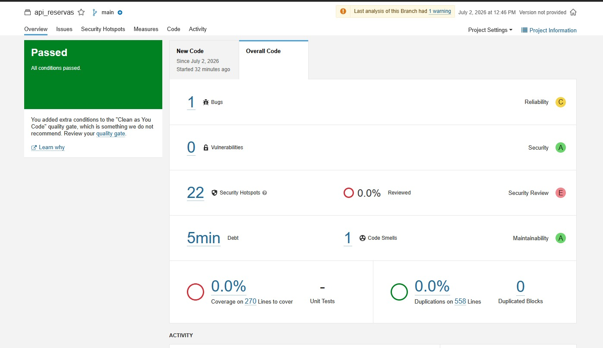
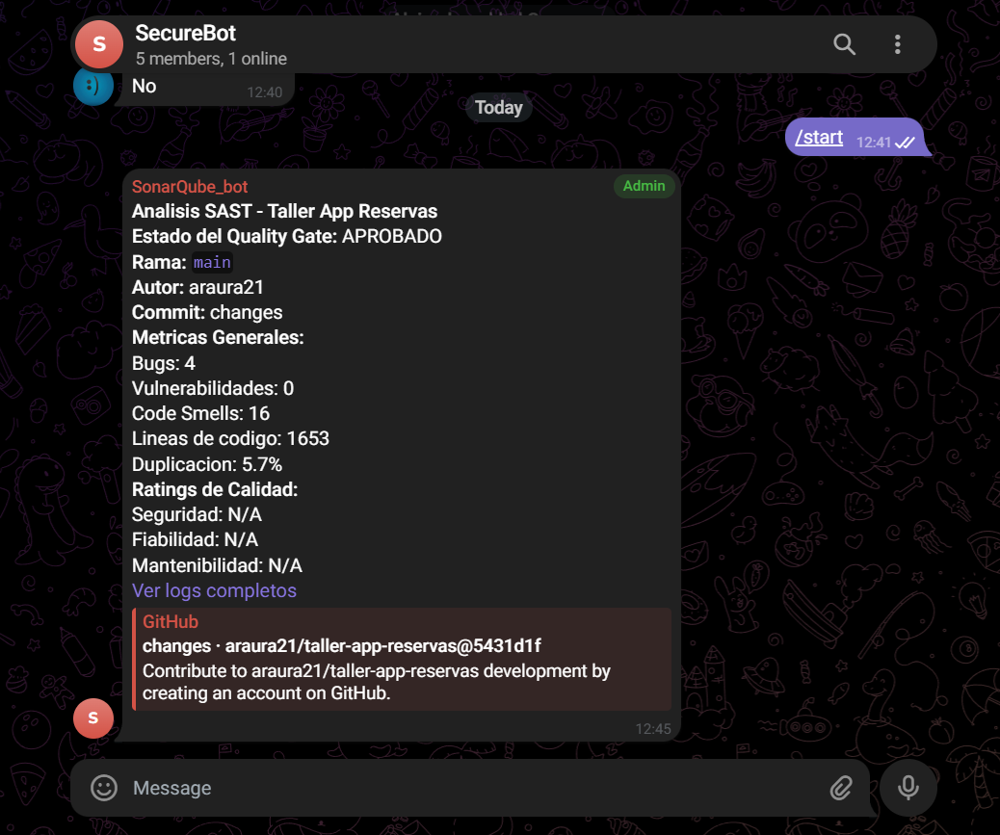

# Evidencias — Presentación del taller

Guía para capturar las **2 evidencias** que pide `Tarea.md`.

---

## Antes de presentar — checklist

- [ ] Secrets en GitHub: `TELEGRAM_BOT_TOKEN`, `TELEGRAM_CHAT_ID`
- [ ] Bot invitado al grupo de Telegram
- [ ] Push a `main` ejecutó `SonarQube SAST Analysis` sin error de Telegram
- [ ] Carpeta `orders-service/src/` presente (errores intencionales)

---

## Evidencia 1 — Quality Gate FALLIDO en SonarQube

### Opción A: Captura desde CI (recomendada para demo en vivo)

1. Hacer push a `main`
2. Abrir GitHub Actions → run de **SonarQube SAST Analysis**
3. En el paso **Reporte en GitHub** ver métricas y estado **FALLADO**
4. Para captura en SonarQube UI local (opcional):
   ```bash
   docker compose -f docker-compose.sonar.yml up -d
   export SONAR_TOKEN=<token>
   ./tools/import-quality-gate.sh
   ./tools/run-sonar-analysis.sh
   ```
5. Abrir http://localhost:9000/dashboard?id=taller-app-reservas
6. Capturar pantalla con **StrictGate en rojo** y métricas incumplidas

### Qué debe verse

- Proyecto: `taller-app-reservas`
- Quality Gate: **Failed**
- Issues en `orders-service/` (duplicación, complejidad, security hotspots)

### Captura



---

## Evidencia 2 — Notificación automática en Telegram

### Pasos

1. Hacer un commit y push a `main` o `develop`
2. Esperar que termine **SonarQube SAST Analysis** (~5–10 min)
3. Revisar el grupo de Telegram

### Qué debe verse en el mensaje

- **Analisis SAST - Taller App Reservas**
- Estado del Quality Gate: **APROBADO** o **FALLADO**
- Autor, rama, commit
- Archivos modificados
- Métricas (bugs, smells, duplicación, etc.)
- Enlaces al commit y logs

### Captura



---

## Guion sugerido para la presentación (5 min)

1. **Contexto** — Por qué Quality Gates + Telegram en un equipo de desarrollo
2. **StrictGate** — Mostrar `qualitygate.json` y tabla de umbrales en README
3. **Demo CI** — Push → Actions falla (gate) → Telegram llega con métricas
4. **Evidencia SonarQube** — Gate fallido por `orders-service` (errores intencionales)
5. **Roles** — Líder calidad, DevOps, desarrolladores

---

## Entregables en el repositorio

```text
.github/workflows/sonarqube.yml      ← CI SonarQube
.github/workflows/telegram-notify.yml ← Entregable Telegram
qualitygate.json                      ← StrictGate
tools/telegram-notify.sh              ← Script de notificación
orders-service/                       ← Demo gate fallido
README.md                             ← Documentación completa
```

---

## Problemas frecuentes

| Problema | Solución |
|----------|----------|
| Métricas en 0 | Verificar paso "Listar archivos indexados" en Actions |
| Telegram no llega | Revisar secrets y que el bot esté en el grupo |
| Gate pasa cuando debería fallar | Confirmar que `orders-service/src/` está en el repo |
| Workflow muy lento | Normal (~5–10 min); SonarQube arranca contenedor en CI |
